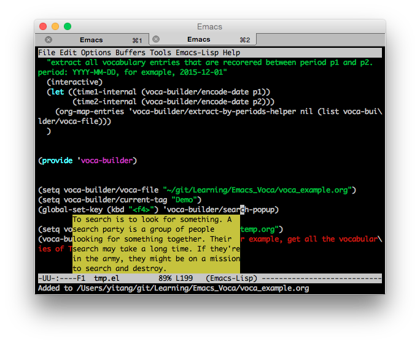
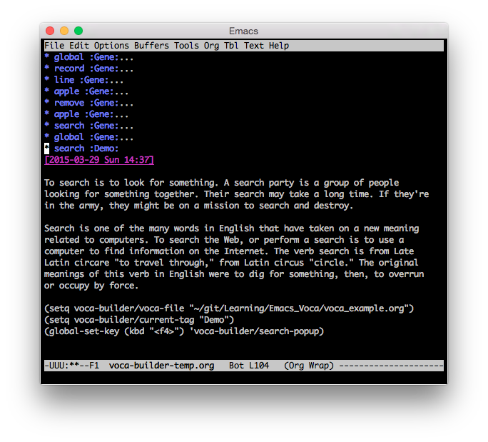
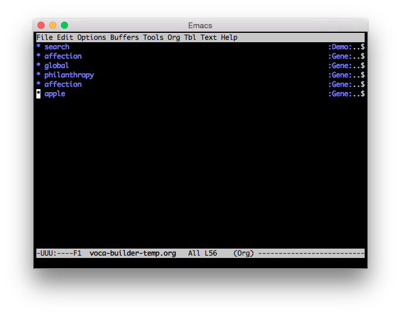

# voca-builder

voca-builder is an Emacs package that aimed to help you build up your vocabulary by automating the most step in the process, so that you actually spent time in learning new words. 

If you are learning a foreign language, you know how tedious and time-consuming it is to check a new word that you are not familiar with, it breaks you reading-flow, and therefore decrease your efficient. 

voca-builder provides excellent functionality that will do the checking for you, and shows the meaning as a popup above the text that you are reading. It also records the meaning and the sentence containing the word. All you need to do is press a key. 

It can also groups the vocabulary an later on, you can export new vocabularies based on tags or time period.  

For full documentation on this package, please see the wiki page.

# Demo

    (require 'voca-builder)
    (setq voca-builder/voca-file "~/git/Learning/Emacs_Voca/voca_example.org") 
    (setq voca-builder/current-tag "Demo")
    (global-set-key (kbd "<f4>") 'voca-builder/search-popup)
    
    (setq voca-builder/export-file "~/voca-builder-temp.org") 
    (voca-builder/extract-by-tags "Demo") 
    (voca-builder/extract-period "2015-01-05" "2015-04-01")

I moved the cursor to *c* under *search*, and press F4, it shows the short meaning, which has been added to a file, as the echo area shows. 

Export all the vocabularies that are tagged by *Demo*

Export all the vocabularies that are recorded between "2015-01-05" and "2014-04-01"

Here is a real example when I was reading an article.

# It Make Your Life Easier

Image the process you want to look in a new word, it probably would like this: 

1.  put down the book you reading,
2.  find the dictionary or open the app,
3.  repeat step 1-2 few times if the vocabulary is quit complex,
4.  now you get the meaning, trying to comprehensive it,
5.  then you write it down in a note book, with the meaning,
6.  if you are very serious, you probably write down the sentence as an example,
7.  after all these, you go back to continue reading but lost the flow.

What if you can do the step 1-6 automatically, and immediately as you
thought you wanna see what's the meaning of a word? This is what
voca-bulder can do for you, all you need to do is press F4 (the
default setting), without leaving Emacs, searching and recording.
Sounds pretty cool is it?

Even more important, you can quary your vocbaulary database, and
search, for example, if you are prepare an interview in banking
sector, you can bring up all the banking related terminology, and
study them all together, or you wanna strength your memmoery and wants
to remmeber again before you forget, you can bring up all the words
you learnt last week, or this month etc.

# Human-Friendly Dictionary Database

take conciousness for example, definition from oxford is 

    [MASS NOUN] The state of being aware of and responsive to one’s surroundings:

while for vocabuary.com, it has more human friendly defition, which are for human, and edited by humans. 

    When you are awake and aware of your surroundings, that's consciousness. There are different types of consciousness, including social consciousness, being aware of injustices in society.

    The early Latin word conscius meant "with knowing," but it meant a shared knowledge, a meaning that was retained through the 16th Century. John Locke was the first to describe consciousness in relation to the individual, referring to it as “the perception of what passes in a man’s own mind." If you lose consciousness during the performance, we'll wake you up with some smelling salts!

# TODO TODO

1.  Currently voca-builder only supports English dictionary (www.vocabulary.com) and will add other languages later.
2.  Write Documentation
